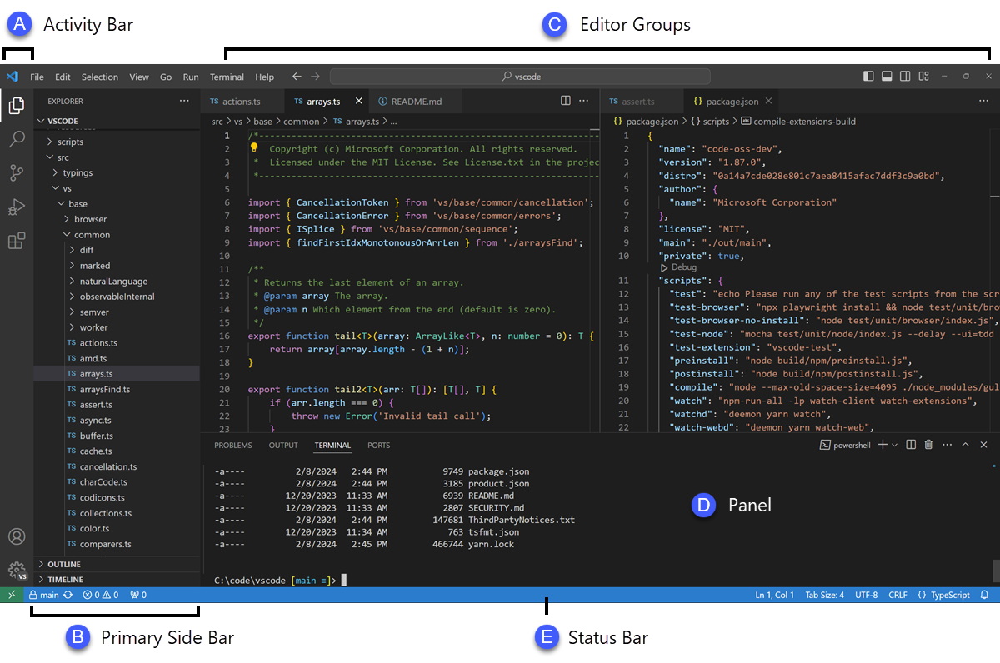
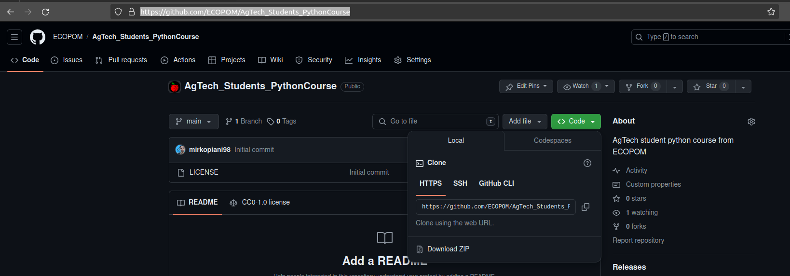
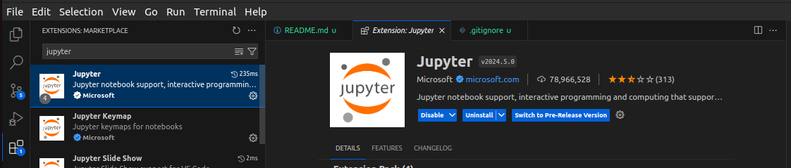

ECOPOM as a research group of the University of Bologna (IT), with Prof. Manfrini and Mengoli giving lectures at the Master Degree course ["*Precision And Sustainable Agriculture (PASA)*"](https://corsi.unibo.it/2cycle/PreciseSustainableAgriculture), engages students with thesis aimimng at developing/testing new AgTech technologies for the Precision Orchard Management (POM).

To better comprehend those topics, a basic training on Python and automation is given to students. This repository contains the material needed to deepend in this context.

# How to use this repository

## 1. install a Virtual Environment Manager
Install any [Virtual Environment Manager](https://dev.to/bowmanjd/python-tools-for-managing-virtual-environments-3bko) (VEM) on your computer. The suggested VEM for beginners is [Anaconda](https://docs.anaconda.com/free/anaconda/install/).\
If you are installing Anaconda use the installer that better fits with your machine *Operating System* (OS) (i.e., *Windows*, *MacOS*, *Linux*, etc).

> **Note:** to install Anaconda you'll be asked to register (it's free).

### 1.1. Create a Virtual Environment (venv)
When creating a [virtual environment](https://realpython.com/python-virtual-environments-a-primer/) with Anandonda, Python gets directly installed inside each *venv*. If you are working with a different VEM such as [*venv*](https://dev.to/bowmanjd/python-tools-for-managing-virtual-environments-3bko#virtualenv) you'll need to [install Python by yourself](https://www.datacamp.com/blog/how-to-install-python).

**A. Create a *venv* using the Anaconda Navigator Graphic User Inteface (GUI)**
Here you can find a comprehensive [documentation](https://docs.anaconda.com/free/navigator/getting-started/) on how to use Anaconda Navigator based on your machine's OS.

**B. Create a *venv* using the Anaconda Prompt**\
Usually, Anaconda is referred to as `conda`.

create the environment with the **name** you prefer

    conda create --name <venv_name>

then **activate it**

    conda activate <venv_name>

More documentation on create, update, remove, and export your conda environments could be found at the following [link](https://conda.io/projects/conda/en/latest/user-guide/tasks/manage-environments.html) and in the *Anaconda Cheat Sheet* available in the folder [*docs*](docs/anaconda_CheatSheet/conda-24.4.0.pdf).

## 2. install an Integrated Development Environment (IDE)
Install an [Integrated Development Environment](https://realpython.com/python-ides-code-editors-guide/) that could be both a General Editor such as [*Visual Studio Code*](https://code.visualstudio.com/download) (*vscode*) or a Python-Specific Editor as *PyCharm* community edition. We encourage to use *vscode* since it supports many features, plugins and programming languages.

[Here](https://code.visualstudio.com/docs/getstarted/userinterface) you can find some documentation on how to interact with the *vscode* user interface.

## 3. Download the repository
A. Open the [GitHub repository](https://github.com/ECOPOM/AgTech_Students_PythonCourse) click on **`<>Code`** (the green appearing button), then **Local** and **Download ZIP**

B. Surf to you Computer's *Downloads* folder, right click on `AgTech_Students_PythonCourse-main.zip` file and extract the folder content into your *Desktop*.

## 4. Use the repository
### 4.1. Open the repository with vscode
Start vscode, the from menù ***file*** > *Open folder...* > *Desktop/AgTech_Students_PythonCourse-main*

### 4.2. install requirements
Open the *Anaconda Prompt*, **activate the *venv*** and make sure you have `pip` ([Python package manager](https://www.w3schools.com/python/python_pip.asp)) installed:

    conda list

if `pip` or `pip3` does not appear in the list of installed packages, do the following:

    conda install pip

After all, from the Anaconda Prompt do the following:

    # change directory to the repository folder
    cd Desktop/AgTech_Students_PythonCourse-main

    # install packages and modules with PIP
    pip install -r requirements.txt

### 4.3. use notebook materials

You can either decide to use [notebook](https://realpython.com/jupyter-notebook-introduction/) materials with [*Jupyter Notebooks*](https://jupyter.org/), which is native of anaconda, or by exploiting [vscode jupyter plugin](https://code.visualstudio.com/docs/datascience/jupyter-notebooks) (**recommended**).

**List of notebooks**
| file | topic |
|:---|---|
|*0_ipynb_introduction.ipynb*| Introduction to notebooks|
|*1_native_python_data_structures.ipynb*| Introduction to native Python data structures |
|*2_python_operators.ipynb*| python operators |
|*3_numpy.ipynb*| NumPy arrays |
|*4_pandas.ipynb*| Pandas Dataframes |
|*5_introduction_to_images.ipynb*| Image data introduction |

